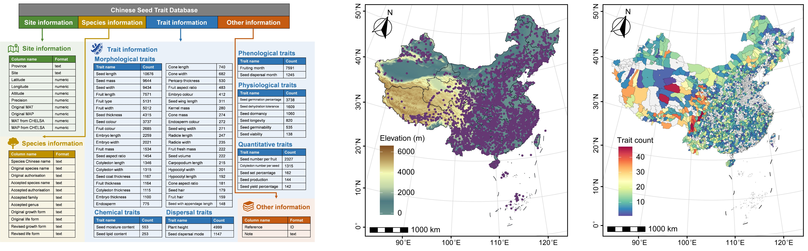

```{r setup, include=FALSE}
knitr::opts_chunk$set(echo = TRUE)
```

## [Chinese Seed Trait Database (CSTD)](https://doi.org/10.1111/nph.70296)

- [**CSTD**](https://macroecologygroup.shinyapps.io/CSTD) is a curated database that compiles an extensive array of seed traits for plant species across all provinces of China (7.4°~52.9°N, 74.6°~133.7°E).
- Until December 2024, CSTD includes **over 110,000** records across **118** distinct seed traits for **3,897** species in **1,416** genera and **214** families, covering a broad range of climates and biomes with most records geo-referenced.
- Data can also be downloaded in Figshare: <https://doi.org/10.6084/m9.figshare.28152035>.
- If you are interested in contributing to the development and improvement of this database, please [contact me](mailto:chensichong0528@gmail.com).

<div style="text-align:center; margin-top:10px; margin-bottom:25px;">



</div>