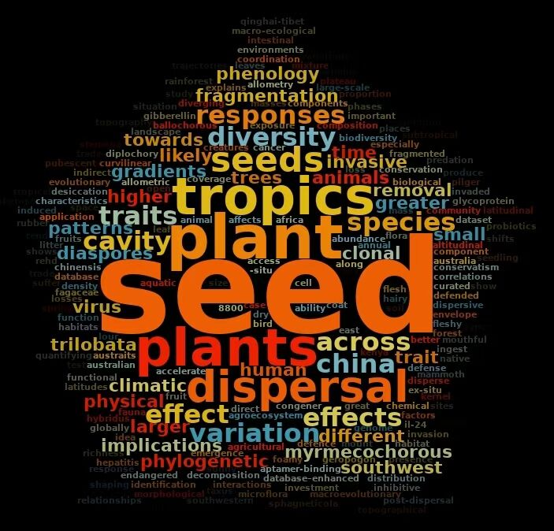

```{r setup, include=FALSE}
knitr::opts_chunk$set(echo = TRUE)
```

<div style="text-align:center; margin-top:30px; margin-bottom:30px;">



</div>

<hr>

### Featured Publications

See also: [ResearchGate](https://www.researchgate.net/profile/Si-Chong-Chen) | [ORCID](https://orcid.org/0000-0002-6855-2595) | [Google Scholar](https://scholar.google.com/citations?hl=zh-CN&user=BcKbEYsAAAAJ)<br>

<br>

`*`: Corresponding author; `#`: Co-first author.

<script type='text/javascript' src='https://d1bxh8uas1mnw7.cloudfront.net/assets/embed.js'></script>
<script async src="https://badge.dimensions.ai/badge.js" charset="utf-8"></script>

<ul style="list-style-type: disc;">

<div class = "row">
<div class = "col-md-10">
<li> Poschlod P\*, Mašková T\*, **Chen S-C**, Phartyal SS, Rosbakh S, Silveira FAO, Saatkamp A, Dalling JW, Dalziell E, Dickie JB, Fernandez-Pascual E, Guja L, Jimenez-Alfaro B, Merritt DJ, Ooi MKJ, Vandelook P. (2026) A handbook for standardised measurements of regenerative plant functional traits. *Australian Journal of Botany* 74(2): BT25074. [https://doi.org/10.1071/BT25074](https://doi.org/10.1071/BT25074) 
</div>
<div class = "col-md-2">
<div data-doi="10.1071/BT25074" data-hide-no-mentions="true" class="altmetric-embed"></div>
<span class="__dimensions_badge_embed__" data-doi="10.1071/BT25074" data-style="small_rectangle"></span>
</div>
</div>

<div class = "row">
<div class = "col-md-10">
<li> **Xie L**#, **Huang X**#, **Xia T**, **Wu L** & **Chen S-C**\*. (2026) Large old trees sustain avian communities and critical plant-bird interactions in highly urbanised environments. *Biological Conservation* 313: 111582. [https://doi.org/10.1016/j.biocon.2025.111582](https://doi.org/10.1016/j.biocon.2025.111582) (Media: [中新网](https://m.chinanews.com/wap/detail/chs/zw/10509715.shtml))
</div>
<div class = "col-md-2">
<div data-doi="10.1016/j.biocon.2025.111582" data-hide-no-mentions="true" class="altmetric-embed"></div>
<span class="__dimensions_badge_embed__" data-doi="10.1016/j.biocon.2025.111582" data-style="small_rectangle"></span>
</div>
</div>

<div class = "row">
<div class = "col-md-10">
<li> **Huang X** & **Chen S-C**\*. (2025) Humans perceive but animals don’t: Pitfalls in using plasticine models for assessing biotic interactions. *Proceedings of the Royal Society B* 292(2057): 20252247. [https://doi.org/10.1098/rspb.2025.2247](https://doi.org/10.1098/rspb.2025.2247) (Media: [湖北日报](https://news.hubeidaily.net/hbrbsharenew/news_detail/5/4687350/4209654/0?w=1761217803731&uik=8XPWnXgK&share_plat=wechat&sec=26127815&contentType=5&tencentShare=1&historyback=1))
</div>
<div class = "col-md-2">
<div data-doi="10.1098/rspb.2025.2247" data-hide-no-mentions="true" class="altmetric-embed"></div>
<span class="__dimensions_badge_embed__" data-doi="10.1098/rspb.2025.2247" data-style="small_rectangle"></span>
</div>
</div>

<div class = "row">
<div class = "col-md-10">
<li> Fu Z#, Zhan Q#, Lenoir J#, Wang S, Qian H, Yang J, Sun W, Mbuni YM, Ngumbau VM, Hu G, Yan X, Wang Q-F, **Chen S-C**\* & Zhou Y\*. (2025) Climate change drives plant diversity attrition at the summit of Mount Kenya. *New Phytologist*. (In press) [https://doi.org/10.1111/nph.20344](https://doi.org/10.1111/nph.20344) 
</div>
<div class = "col-md-2">
<div data-doi="10.1111/nph.20344" data-hide-no-mentions="true" class="altmetric-embed"></div>
<span class="__dimensions_badge_embed__" data-doi="10.1111/nph.20344" data-style="small_rectangle"></span>
</div>
</div>

<div class = "row">
<div class = "col-md-10">
<li> **Wang H-Y**, **Chen X**, **Chen S-C**\*. (2025) Chinese Seed Trait Database: A curated resource for seed traits in the Chinese flora. *New Phytologist* 248(1): 11–16 ([**Cover Story**](https://nph.onlinelibrary.wiley.com/toc/14698137/2025/248/1)) [https://doi.org/10.1111/nph.70296](https://doi.org/10.1111/nph.70296) (Media: [EurekAlert!](https://www.eurekalert.org/news-releases/1087365), [光明日报](https://news.gmw.cn/2025-06/14/content_38090073.htm), [中新网](https://www.chinanews.com.cn/gn/2025/06-13/10431768.shtml), [Phys.org](https://phys.org/news/2025-06-database-bridges-global-gaps-trait.html), [中国科学院](https://www.cas.cn/syky/202506/t20250613_5072972.shtml))
</div>
<div class = "col-md-2">
<div data-doi="10.1111/nph.70296" data-hide-no-mentions="true" class="altmetric-embed"></div>
<span class="__dimensions_badge_embed__" data-doi="10.1111/nph.70296" data-style="small_rectangle"></span>
</div>
</div>

<div class = "row">
<div class = "col-md-10">
<li> Barrero JM, Buitink J, **Chen S-C**, da Silva EAA, Hay F, Leprince O, Pawłowski TA, Pérez HE, Vijay D. (2025) Celebrating the 25th Anniversary of the International Society for Seed Science. *Seed Science Research* 1–8. [https://doi.org/10.1017/S0960258525000029](https://doi.org/10.1017/S0960258525000029) (Editorial)
</div>
<div class = "col-md-2">
<div data-doi="10.1017/S0960258525000029" data-hide-no-mentions="true" class="altmetric-embed"></div>
<span class="__dimensions_badge_embed__" data-doi="10.1017/S0960258525000029" data-style="small_rectangle"></span>
</div>
</div>

<div class = "row">
<div class = "col-md-10">
<li> Wan J-N, Wang S-W, **Chen S-C** & Wan T\*. (2025) Escarpment evolution in Madagascar unveils a pathway to understanding island biodiversity. *Journal of Systematics and Evolution* 63(2): 205–207. [https://doi.org/10.1111/jse.13162](https://doi.org/10.1111/jse.13162) 
</div>
<div class = "col-md-2">
<div data-doi="10.1111/jse.13162" data-hide-no-mentions="true" class="altmetric-embed"></div>
<span class="__dimensions_badge_embed__" data-doi="10.1111/jse.13162" data-style="small_rectangle"></span>
</div>
</div>

<div class = "row">
<div class = "col-md-10">
<li> **Chen S-C**\*, Antonelli A, **Huang X**, Wei N, Dai C & Wang Q\*. (2025) Large seeds as a defensive strategy against partial granivory in the Fagaceae. *Journal of Ecology* 113(3): 598–607. [https://doi.org/10.1111/1365-2745.14480](https://doi.org/10.1111/1365-2745.14480) (Media: [EurekAlert!](https://www.eurekalert.org/news-releases/1071421), [Journal of Ecology Blog](https://jecologyblog.com/2025/02/18/big-seeds-are-smarter-than-they-look/), [中国科学院](https://english.cas.cn/newsroom/research_news/life/202501/t20250122_899111.shtml), [湖北日报](https://news.hubeidaily.net/hbrbsharenew/news_detail/5/3653863/3306030/0?w=1739884983573%3Fuik%3DWXQ6wh4n&share_plat=wechat&sec=176f59d5&uik=8W6WKjLo&contentType=5))
</div>
<div class = "col-md-2">
<div data-doi="10.1111/1365-2745.14480" data-hide-no-mentions="true" class="altmetric-embed"></div>
<span class="__dimensions_badge_embed__" data-doi="10.1111/1365-2745.14480" data-style="small_rectangle"></span>
</div>
</div>

<div class = "row">
<div class = "col-md-10">
<li> **Huang X**, Dalsgaard B & **Chen S-C**\*. (2025) Weaker plant-frugivore trait matching towards the tropics and on islands. *Ecology Letters* 28(1): e70061. [https://doi.org/10.1111/ele.70061](https://doi.org/10.1111/ele.70061) (Media: [中国科学院](https://english.cas.cn/newsroom/research_news/life/202502/t20250213_901667.shtml))
</div>
<div class = "col-md-2">
<div data-doi="10.1111/ele.70061" data-hide-no-mentions="true" class="altmetric-embed"></div>
<span class="__dimensions_badge_embed__" data-doi="10.1111/ele.70061" data-style="small_rectangle"></span>
</div>
</div>

<div class = "row">
<div class = "col-md-10">
<li> Carta A\*, Vandelook F, Ramírez-Barahona S, **Chen S-C**, Dickie J, Steinbrecher T, Thanos CA, Moles AT, Leubner-Metzger G & Mattana E. (2024) The seed morphospace, a new contribution towards the multidimensional study of angiosperm sexual reproductive biology. *Annals of Botany* 134(5): 701–710. [https://doi.org/10.1093/aob/mcae099](https://doi.org/10.1093/aob/mcae099) 
</div>
<div class = "col-md-2">
<div data-doi="10.1093/aob/mcae099" data-hide-no-mentions="true" class="altmetric-embed"></div>
<span class="__dimensions_badge_embed__" data-doi="10.1093/aob/mcae099" data-style="small_rectangle"></span>
</div>
</div>

<div class = "row">
<div class = "col-md-10">
<li> Wan J-N#, Wang S-W#, Leitch AR, Leitch IJ, Jian J-B, Wu Z-Y, Xin H-P, Rakotoarinivo M, Onjalalaina GE, Gituru RW, Dai C, Mwachala G, Bai M-Z, Zhao C-X, Wang H-Q, Du S-L, Wei N, Hu G-W, **Chen S-C**, Chen X-Y, Wan T\* & Wang Q-F\*. (2024) The rise of baobab trees in Madagascar. *Nature* 629:1091–1099. [https://doi.org/10.1038/s41586-024-07447-4](https://doi.org/10.1038/s41586-024-07447-4) 
</div>
<div class = "col-md-2">
<div data-doi="10.1038/s41586-024-07447-4" data-hide-no-mentions="true" class="altmetric-embed"></div>
<span class="__dimensions_badge_embed__" data-doi="10.1038/s41586-024-07447-4" data-style="small_rectangle"></span>
</div>
</div>

<div class = "row">
<div class = "col-md-10">
<li> **Wu L-M**, **Chen S-C**, Quan R-C & Wang B\*. (2024) Disentangling the relative contributions of factors determining seed physical defence: A global-scale data synthesis. *Functional Ecology* 38(5), 1146–1155. [https://doi.org/10.1111/1365-2435.14552](https://doi.org/10.1111/1365-2435.14552) 
</div>
<div class = "col-md-2">
<div data-doi="10.1111/1365-2435.14552" data-hide-no-mentions="true" class="altmetric-embed"></div>
<span class="__dimensions_badge_embed__" data-doi="10.1111/1365-2435.14552" data-style="small_rectangle"></span>
</div>
</div>

<div class = "row">
<div class = "col-md-10">
<li> **Chen S-C**, Hu X-W\*, Baskin CC & Baskin JM. (2024) A long-term experiment reveals no trade-off between seed persistence and seedling emergence. *New Phytologist* 241(2): 623–631. (Commentary on this article by Meitzel, 241(2): 521–522. [https://doi.org/10.1111/nph.19350](https://doi.org/10.1111/nph.19350)) 
</div>
<div class = "col-md-2">
<div data-doi="10.1111/nph.19350" data-hide-no-mentions="true" class="altmetric-embed"></div>
<span class="__dimensions_badge_embed__" data-doi="10.1111/nph.19350" data-style="small_rectangle"></span>
</div>
</div>

<div class = "row">
<div class = "col-md-10">
<li> **Chen S-C**\*, **Hu Z-A** & Dai C. (2023) Unveiling human impacts on pollinators and pollination in the urbanisation era. *Integrative Zoology* 18(6): 1108–1110. [https://doi.org/10.1111/1749-4877.12760](https://doi.org/10.1111/1749-4877.12760) 
</div>
<div class = "col-md-2">
<div data-doi="10.1111/1749-4877.12760" data-hide-no-mentions="true" class="altmetric-embed"></div>
<span class="__dimensions_badge_embed__" data-doi="10.1111/1749-4877.12760" data-style="small_rectangle"></span>
</div>
</div>

<div class = "row">
<div class = "col-md-10">
<li> Silveira FAO, Fuzessy L, Dayrell RLC, Vandelook F, Vázquez-Ramírez J, Tavşanoğlu C, Abedi M, Naidoo S, Acosta-Rojas DC, **Chen S-C**, Cruz-Tejada DM, Jayasuryia G, Ordóñez-Parra CA & Saatkamp A. (2023) Overcoming major barriers in seed ecology research in developing countries. *Seed Science Research* 33(3):172–181. [https://doi.org/10.1017/S0960258523000181](https://doi.org/10.1017/S0960258523000181) 
</div>
<div class = "col-md-2">
<div data-doi="10.1017/S0960258523000181" data-hide-no-mentions="true" class="altmetric-embed"></div>
<span class="__dimensions_badge_embed__" data-doi="10.1017/S0960258523000181" data-style="small_rectangle"></span>
</div>
</div>

<div class = "row">
<div class = "col-md-10">
<li> Fuji A\*, Kusumoto B, Shiono T, Kubota Y\*, Ulrich W, Dickie JB & **Chen S-C**. (2023) Geographic patterns of seed dormancy strategies along latitudinal and climatic gradients, Japanese East Asian islands. *Japanese Journal of Statistics and Data Science* 6: 885–901. [https://doi.org/10.1007/s42081-023-00215-0](https://doi.org/10.1007/s42081-023-00215-0) 
</div>
<div class = "col-md-2">
<div data-doi="10.1007/s42081-023-00215-0" data-hide-no-mentions="true" class="altmetric-embed"></div>
<span class="__dimensions_badge_embed__" data-doi="10.1007/s42081-023-00215-0" data-style="small_rectangle"></span>
</div>
</div>

<div class = "row">
<div class = "col-md-10">
<li> Yan K#, Luo Y-H#, Li Y-J, Du L-P, Gui H\* & **Chen S-C**\*. (2023) Trajectories of soil microbial recovery in response to restoration strategies in one of the largest and oldest open-pit phosphate mine in Asia. *Ecotoxicology and Environmental Safety* 262: 115215. [https://doi.org/10.1016/j.ecoenv.2023.115215](https://doi.org/10.1016/j.ecoenv.2023.115215) 
</div>
<div class = "col-md-2">
<div data-doi="10.1016/j.ecoenv.2023.115215" data-hide-no-mentions="true" class="altmetric-embed"></div>
<span class="__dimensions_badge_embed__" data-doi="10.1016/j.ecoenv.2023.115215" data-style="small_rectangle"></span>
</div>
</div>

<div class = "row">
<div class = "col-md-10">
<li> Fernández-Pascual E, Carta A, Rosbakh S, Guja L, Phartyal S, Silveira F, **Chen S-C**, Larson J & Jiménez-Alfaro B. (2023) SeedArc, a global archive of primary seed germination data. *New Phytologist* 240(2): 466–470. [https://doi.org/10.1111/nph.19143](https://doi.org/10.1111/nph.19143) 
</div>
<div class = "col-md-2">
<div data-doi="10.1111/nph.19143" data-hide-no-mentions="true" class="altmetric-embed"></div>
<span class="__dimensions_badge_embed__" data-doi="10.1111/nph.19143" data-style="small_rectangle"></span>
</div>
</div>

<div class = "row">
<div class = "col-md-10">
<li> Everingham S, **Chen S-C**, Lewandrowski W & Plumanns-Pouton E. (2023) Novel and emerging seed science research from early to middle career researchers at the Australasian Seed Science Conference, 2021. *Australian Journal of Botany* 71(7): 371–378. (Invited paper) [https://doi.org/10.1071/BT22101](https://doi.org/10.1071/BT22101) 
</div>
<div class = "col-md-2">
<div data-doi="10.1071/BT22101" data-hide-no-mentions="true" class="altmetric-embed"></div>
<span class="__dimensions_badge_embed__" data-doi="10.1071/BT22101" data-style="small_rectangle"></span>
</div>
</div>

<div class = "row">
<div class = "col-md-10">
<li> Zhang H-X, **Chen S-C**\*, Bonser SP, Hitchcock TD & Moles AT. (2023) Factors that shape large-scale gradients in reproductive mode selection. *Journal of Biogeography* 50(5): 827–837. ([Editors’ Choice](https://journalofbiogeographynews.org/2023/04/05/plant-reproductive-mode))
</div>
<div class = "col-md-2">
<div data-doi="10.1111/jbi.14583" data-hide-no-mentions="true" class="altmetric-embed"></div>
<span class="__dimensions_badge_embed__" data-doi="10.1111/jbi.14583" data-style="small_rectangle"></span>
</div>
</div>

<div class = "row">
<div class = "col-md-10">
<li> Zi H, Jing X, Liu A, Fan X, **Chen S-C**, Wang H\* & He J-S. (2023) Simulated climate warming decreases fruit number but increases seed mass. *Global Change Biology* 29(3): 841–855. [https://doi.org/10.1111/gcb.16498](https://doi.org/10.1111/gcb.16498) 
</div>
<div class = "col-md-2">
<div data-doi="10.1111/gcb.16498" data-hide-no-mentions="true" class="altmetric-embed"></div>
<span class="__dimensions_badge_embed__" data-doi="10.1111/gcb.16498" data-style="small_rectangle"></span>
</div>
</div>

<div class = "row">
<div class = "col-md-10">
<li> Wang M, et al. (including **Chen S-C**). (2022). Research progress on insect diversity. *Biodiversity Science* 30(10):22454 (in Chinese with English Abstract). [王明强 罗阿蓉 周青松 陈婧婷 谢婷婷 李逸 Douglas Chesters 石晓宇 肖晖 刘桓吉 丁强 周璇 罗一平 路园园 佟一杰 赵政宇 白明 郭鹏飞 **陈思翀** Akihiro Nakamura 彭艳琼 赵延会 魏淑花 林晓龙 陈华燕 罗世孝 陆宴辉 鲁亮 余建平 周欣 邹怡 路浩 朱朝东 (2022) 昆虫多样性30年研究进展. *生物多样性*, 30, 22454.] [https://doi.org/10.17520/biods.2022454](https://doi.org/10.17520/biods.2022454)
</div>
<div class = "col-md-2">
<div data-doi="10.17520/biods.2022454" data-hide-no-mentions="true" class="altmetric-embed"></div>
<span class="__dimensions_badge_embed__" data-doi="10.17520/biods.2022454" data-style="small_rectangle"></span>
</div>
</div>

<div class = "row">
<div class = "col-md-10">
<li> Njoroge DM, **Chen S-C**, Zuo J\*, Dossa GGO\* & Cornelissen JHC. (2022) Soil fauna accelerate litter mixture decomposition globally, especially in dry environments. *Journal of Ecology* 110(3): 659–672. [https://doi.org/10.1016/j.geoderma.2025.117312](https://doi.org/10.1016/j.geoderma.2025.117312) 
</div>
<div class = "col-md-2">
<div data-doi="10.1016/j.geoderma.2025.117312" data-hide-no-mentions="true" class="altmetric-embed"></div>
<span class="__dimensions_badge_embed__" data-doi="10.1016/j.geoderma.2025.117312" data-style="small_rectangle"></span>
</div>
</div>

<div class = "row">
<div class = "col-md-10">
<li> Zhou Y-D#, Xiao K-Y#, **Chen S-C**, Liu X, Wang Q-F\* & Yan X\*. (2022) Altitudinal diversity of aquatic plants in the Qinghai-Tibet Plateau. *Freshwater Biology* 67(4): 709–719. [https://doi.org/10.1111/fwb.13875](https://doi.org/10.1111/fwb.13875) 
</div>
<div class = "col-md-2">
<div data-doi="10.1111/fwb.13875" data-hide-no-mentions="true" class="altmetric-embed"></div>
<span class="__dimensions_badge_embed__" data-doi="10.1111/fwb.13875" data-style="small_rectangle"></span>
</div>
</div>

<div class = "row">
<div class = "col-md-10">
<li> Wang G, Ives AR, Zhu H, Tan Y, **Chen S-C**, Yang J & Wang B\*. (2022). Phylogenetic conservatism explains why plants are more likely to produce fleshy fruits in the tropics. *Ecology* 103(1): e03555. [https://doi.org/10.1002/ecy.3555](https://doi.org/10.1002/ecy.3555)
</div>
<div class = "col-md-2">
<div data-doi="10.1002/ecy.3555" data-hide-no-mentions="true" class="altmetric-embed"></div>
<span class="__dimensions_badge_embed__" data-doi="10.1002/ecy.3555" data-style="small_rectangle"></span>
</div>
</div>

<div class = "row">
<div class = "col-md-10">
<li> Falster D\*, et al. (including **Chen S-C**). (2021). AusTraits, a curated plant trait database for the Australian flora. *Scientific Data* 8 (1): 1–20. [https://doi.org/10.1038/s41597-021-01006-6](https://doi.org/10.1038/s41597-021-01006-6) 
</div>
<div class = "col-md-2">
<div data-doi="10.1038/s41597-021-01006-6" data-hide-no-mentions="true" class="altmetric-embed"></div>
<span class="__dimensions_badge_embed__" data-doi="10.1038/s41597-021-01006-6" data-style="small_rectangle"></span>
</div>
</div>

<div class = "row">
<div class = "col-md-10">
<li> **Chen S-C**\*, Wang B & Moles AT. (2021). Exposure time is an important variable in quantifying post-dispersal seed removal. *Ecology Letters* 24(7): 1522–1525. [https://doi.org/10.1111/ele.13744](https://doi.org/10.1111/ele.13744) 
</div>
<div class = "col-md-2">
<div data-doi="10.1111/ele.13744" data-hide-no-mentions="true" class="altmetric-embed"></div>
<span class="__dimensions_badge_embed__" data-doi="10.1111/ele.13744" data-style="small_rectangle"></span>
</div>
</div>

<div class = "row">
<div class = "col-md-10">
<li> Dener E, Ovadia O, Shemesh H, Altman A, **Chen S-C** & Giladi I\*. (2021). Direct and indirect effects of fragmentation on seed dispersal in an agro-ecological landscape. *Agriculture, Ecosystems and Environment* 309: 107273. [https://doi.org/10.1016/j.agee.2020.107273](https://doi.org/10.1016/j.agee.2020.107273) 
</div>
<div class = "col-md-2">
<div data-doi="10.1016/j.agee.2020.107273" data-hide-no-mentions="true" class="altmetric-embed"></div>
<span class="__dimensions_badge_embed__" data-doi="10.1016/j.agee.2020.107273" data-style="small_rectangle"></span>
</div>
</div>

<div class = "row">
<div class = "col-md-10">
<li> **Chen S-C**\*, Poschlod P, Antonelli A, Liu U & Dickie JB. (2020). Trade-off between seed dispersal in space and time. *Ecology Letters* 23(11): 1635–1642. [https://doi.org/10.1111/ele.13595](https://doi.org/10.1111/ele.13595)  
</div>
<div class = "col-md-2">
<div data-doi="10.1111/ele.13595" data-hide-no-mentions="true" class="altmetric-embed"></div>
<span class="__dimensions_badge_embed__" data-doi="10.1111/ele.13595" data-style="small_rectangle"></span>
</div>
</div>

<div class = "row">
<div class = "col-md-10">
<li> **Chen S-C**\*, **Wu L-M**, Wang B & Dickie JB. (2020). Macroevolutionary patterns in seed component mass and different evolutionary trajectories across seed desiccation responses. *New Phytologist* 228(2): 770–777. [https://doi.org/10.1111/nph.16706](https://doi.org/10.1111/nph.16706) 
</div>
<div class = "col-md-2">
<div data-doi="10.1111/nph.16706" data-hide-no-mentions="true" class="altmetric-embed"></div>
<span class="__dimensions_badge_embed__" data-doi="10.1111/nph.16706" data-style="small_rectangle"></span>
</div>
</div>

<div class = "row">
<div class = "col-md-10">
<li> **Chen S-C**\*, Dener E, Altman A, Chen F & Giladi I. (2020). Effect of habitat fragmentation on seed dispersal ability of a wind-dispersed annual in an agroecosystem. *Agriculture, Ecosystems & Environment* 304: 107138. [https://doi.org/10.1016/j.agee.2020.107138](https://doi.org/10.1016/j.agee.2020.107138) 
</div>
<div class = "col-md-2">
<div data-doi="10.1016/j.agee.2020.107138" data-hide-no-mentions="true" class="altmetric-embed"></div>
<span class="__dimensions_badge_embed__" data-doi="10.1016/j.agee.2020.107138" data-style="small_rectangle"></span>
</div>
</div>

<div class = "row">
<div class = "col-md-10">
<li> Moles AT\*, Laffan SW, Keighery M, Dalrymple RL, Tindall ML & **Chen S-C**\*. (2020). A hairy situation: Plant species in warm, sunny places are more likely to have pubescent leaves. *Journal of Biogeography* 47(9): 1934–1944. [https://doi.org/10.1111/jbi.13870](https://doi.org/10.1111/jbi.13870) 
</div>
<div class = "col-md-2">
<div data-doi="10.1111/jbi.13870" data-hide-no-mentions="true" class="altmetric-embed"></div>
<span class="__dimensions_badge_embed__" data-doi="10.1111/jbi.13870" data-style="small_rectangle"></span>
</div>
</div>

<div class = "row">
<div class = "col-md-10">
<li> **Chen S-C**\* & Giladi I. (2020). Variation in morphological traits affects dispersal and seedling emergence in dispersive diaspores of Geropogon hybridus. *American Journal of Botany* 107(3): 436–444. [https://doi.org/10.1002/ajb2.1430](https://doi.org/10.1002/ajb2.1430) 
</div>
<div class = "col-md-2">
<div data-doi="10.1002/ajb2.1430" data-hide-no-mentions="true" class="altmetric-embed"></div>
<span class="__dimensions_badge_embed__" data-doi="10.1002/ajb2.1430" data-style="small_rectangle"></span>
</div>
</div>

<div class = "row">
<div class = "col-md-10">
<li> Kattge J\*, et al. (including **Chen S-C**). (2020). TRY plant trait database – enhanced coverage and open access. *Global Change Biology* 26(1): 119–188. [https://doi.org/10.1111/gcb.14904](https://doi.org/10.1111/gcb.14904) 
</div>
<div class = "col-md-2">
<div data-doi="10.1111/gcb.14904" data-hide-no-mentions="true" class="altmetric-embed"></div>
<span class="__dimensions_badge_embed__" data-doi="10.1111/gcb.14904" data-style="small_rectangle"></span>
</div>
</div>

<div class = "row">
<div class = "col-md-10">
<li> **Chen S-C**\*, Pahlevani AH, Malíková L, Riina R, Thomson FJ & Giladi I. (2019). Trade-off or coordination? Correlations between ballochorous and myrmecochorous phases of diplochory. *Functional Ecology* 33(8): 1469–1479. [https://doi.org/10.1111/1365-2435.13353](https://doi.org/10.1111/1365-2435.13353) 
</div>
<div class = "col-md-2">
<div data-doi="10.1111/1365-2435.13353" data-hide-no-mentions="true" class="altmetric-embed"></div>
<span class="__dimensions_badge_embed__" data-doi="10.1111/1365-2435.13353" data-style="small_rectangle"></span>
</div>
</div>

<div class = "row">
<div class = "col-md-10">
<li> **Chen S-C**\*, Tamme R, Thomson FJ & Moles AT\*. (2019). Seeds tend to disperse further in the tropics. *Ecology Letters* 22(6): 954–961. [https://doi.org/10.1111/ele.13255](https://doi.org/10.1111/ele.13255) 
</div>
<div class = "col-md-2">
<div data-doi="10.1111/ele.13255" data-hide-no-mentions="true" class="altmetric-embed"></div>
<span class="__dimensions_badge_embed__" data-doi="10.1111/ele.13255" data-style="small_rectangle"></span>
</div>
</div>

<div class = "row">
<div class = "col-md-10">
<li> **Wu L-M**#, **Chen S-C**# & Wang B\*. (2019). An allometry between seed kernel and seed coat shows greater investment in physical defense in small seeds. *American Journal of Botany* 106(3): 371–376. [https://doi.org/10.1002/ajb2.1252](https://doi.org/10.1002/ajb2.1252) 
</div>
<div class = "col-md-2">
<div data-doi="10.1002/ajb2.1252" data-hide-no-mentions="true" class="altmetric-embed"></div>
<span class="__dimensions_badge_embed__" data-doi="10.1002/ajb2.1252" data-style="small_rectangle"></span>
</div>
</div>

<div class = "row">
<div class = "col-md-10">
<li> Li N\*, Wang Z, Li X-H, Yi X-F, Yan C, Lu C-H & **Chen S-C**. (2019). Effects of bird traits on seed dispersal of endangered Taxus chinensis (Pilger) Rehd. with ex-situ and in-situ conservation. *Forests* 10(9): 790. [https://doi.org/10.3390/f10090790](https://doi.org/10.3390/f10090790) 
</div>
<div class = "col-md-2">
<div data-doi="10.3390/f10090790" data-hide-no-mentions="true" class="altmetric-embed"></div>
<span class="__dimensions_badge_embed__" data-doi="10.3390/f10090790" data-style="small_rectangle"></span>
</div>
</div>

<div class = "row">
<div class = "col-md-10">
<li> Du Y, Yang B, **Chen S-C** & Ma K\*. (2019). Diverging shifts in spring phenology in response to biodiversity loss in a subtropical forest. *Journal of Vegetation Science* 30(6): 1175–1183. [https://doi.org/10.1111/jvs.12806](https://doi.org/10.1111/jvs.12806) 
</div>
<div class = "col-md-2">
<div data-doi="10.1111/jvs.12806" data-hide-no-mentions="true" class="altmetric-embed"></div>
<span class="__dimensions_badge_embed__" data-doi="10.1111/jvs.12806" data-style="small_rectangle"></span>
</div>
</div>

<div class = "row">
<div class = "col-md-10">
<li> Zhai D-L, Yu H, **Chen S-C**, Ranjitkar S & Xu J\*. (2019). Responses of rubber leaf phenology to climatic variations in Southwest China. *International Journal of Biometeorology* 63(5): 607–616. [https://doi.org/10.1007/s00484-017-1448-4](https://doi.org/10.1007/s00484-017-1448-4) 
</div>
<div class = "col-md-2">
<div data-doi="10.1007/s00484-017-1448-4" data-hide-no-mentions="true" class="altmetric-embed"></div>
<span class="__dimensions_badge_embed__" data-doi="10.1007/s00484-017-1448-4" data-style="small_rectangle"></span>
</div>
</div>

<div class = "row">
<div class = "col-md-10">
<li> Liu J, Tang J, **Chen S-C**, Ma W, Zheng Z & Dong T\*. (2019). Do tree cavity density and characteristics vary across topographical habitats in the tropics? A case study from Xishuangbanna, southwest China. *Silva Fennica* 53(1): 10019. [https://doi.org/10.14214/sf.10019](https://doi.org/10.14214/sf.10019) 
</div>
<div class = "col-md-2">
<div data-doi="10.14214/sf.10019" data-hide-no-mentions="true" class="altmetric-embed"></div>
<span class="__dimensions_badge_embed__" data-doi="10.14214/sf.10019" data-style="small_rectangle"></span>
</div>
</div>

<div class = "row">
<div class = "col-md-10">
<li> **Chen S-C**\* & Giladi I. (2018). Allometric relationships between masses of seed functional components. *Perspectives in Plant Ecology, Evolution and Systematics* 35: 1–7. [https://doi.org/10.1016/j.ppees.2018.09.005](https://doi.org/10.1016/j.ppees.2018.09.005) 
</div>
<div class = "col-md-2">
<div data-doi="10.1016/j.ppees.2018.09.005" data-hide-no-mentions="true" class="altmetric-embed"></div>
<span class="__dimensions_badge_embed__" data-doi="10.1016/j.ppees.2018.09.005" data-style="small_rectangle"></span>
</div>
</div>

<div class = "row">
<div class = "col-md-10">
<li> **Chen S-C**\* & Moles AT. (2018). Factors shaping large-scale gradients in seed physical defence: Seeds are not better defended towards the tropics. *Global Ecology and Biogeography* 27(4): 417–428. [https://doi.org/10.1111/geb.12704](https://doi.org/10.1111/geb.12704) 
</div>
<div class = "col-md-2">
<div data-doi="10.1111/geb.12704" data-hide-no-mentions="true" class="altmetric-embed"></div>
<span class="__dimensions_badge_embed__" data-doi="10.1111/geb.12704" data-style="small_rectangle"></span>
</div>
</div>

<div class = "row">
<div class = "col-md-10">
<li> Liu J-Y, Zheng Z, Xu X, Dong T\* & **Chen S-C**\*. (2018). Abundance and distribution of cavity trees and the effect of topography on cavity presence in a tropical rainforest, southwestern China. *Canadian Journal of Forest Research* 48(9): 1058–1066. [https://doi.org/10.1139/cjfr-2018-0044](https://doi.org/10.1139/cjfr-2018-0044) 
</div>
<div class = "col-md-2">
<div data-doi="10.1139/cjfr-2018-0044" data-hide-no-mentions="true" class="altmetric-embed"></div>
<span class="__dimensions_badge_embed__" data-doi="10.1139/cjfr-2018-0044" data-style="small_rectangle"></span>
</div>
</div>

<div class = "row">
<div class = "col-md-10">
<li> Zhou Y, **Chen S-C**, Hu G, Mwachala G, Yan X\* & Wang Q\*. (2018). Species richness and phylogenetic diversity of seed plants across vegetation zones of Mount Kenya, East Africa. *Ecology and Evolution* 8(17): 8930–8939. [https://doi.org/10.1002/ece3.4428](https://doi.org/10.1002/ece3.4428) 
</div>
<div class = "col-md-2">
<div data-doi="10.1002/ece3.4428" data-hide-no-mentions="true" class="altmetric-embed"></div>
<span class="__dimensions_badge_embed__" data-doi="10.1002/ece3.4428" data-style="small_rectangle"></span>
</div>
</div>

<div class = "row">
<div class = "col-md-10">
<li> Zhang H\*, Bonser SP, **Chen S-C**, Hitchcock T & Moles AT. (2018). Is the proportion of clonal species higher at higher latitudes in Australia? *Austral Ecology* 43(1): 69–75. [https://doi.org/10.1111/aec.12536](https://doi.org/10.1111/aec.12536) 
</div>
<div class = "col-md-2">
<div data-doi="10.1111/aec.12536" data-hide-no-mentions="true" class="altmetric-embed"></div>
<span class="__dimensions_badge_embed__" data-doi="10.1111/aec.12536" data-style="small_rectangle"></span>
</div>
</div>

<div class = "row">
<div class = "col-md-10">
<li> **Chen S-C**\*, Hemmings FA, Chen F & Moles AT. (2017). Plants do not suffer greater losses to seed predation towards the tropics. *Global Ecology and Biogeography* 26(11): 1283–1291. [https://doi.org/10.1111/geb.12636](https://doi.org/10.1111/geb.12636) 
</div>
<div class = "col-md-2">
<div data-doi="10.1111/geb.12636" data-hide-no-mentions="true" class="altmetric-embed"></div>
<span class="__dimensions_badge_embed__" data-doi="10.1111/geb.12636" data-style="small_rectangle"></span>
</div>
</div>

<div class = "row">
<div class = "col-md-10">
<li> **Chen S-C**\*, Cornwell WK, Zhang H-X & Moles AT. (2017). Plants show more flesh in the tropics: Variation in fruit type along latitudinal and climatic gradients. *Ecography* 40(4): 531–538. [https://doi.org/10.1111/ecog.02010](https://doi.org/10.1111/ecog.02010) 
</div>
<div class = "col-md-2">
<div data-doi="10.1111/ecog.02010" data-hide-no-mentions="true" class="altmetric-embed"></div>
<span class="__dimensions_badge_embed__" data-doi="10.1111/ecog.02010" data-style="small_rectangle"></span>
</div>
</div>

<div class = "row">
<div class = "col-md-10">
<li> Chen G\*, Huang S-Z, **Chen S-C**, Chen Y-H, Liu X and Sun W-B\*. (2016). Chemical composition of diaspores of the myrmecochorous plant Stemona tuberosa Lour. *Biochemical Systematics and Ecology* 64: 31–37. [https://doi.org/10.1016/j.bse.2015.11.009](https://doi.org/10.1016/j.bse.2015.11.009) 
</div>
<div class = "col-md-2">
<div data-doi="10.1016/j.bse.2015.11.009" data-hide-no-mentions="true" class="altmetric-embed"></div>
<span class="__dimensions_badge_embed__" data-doi="10.1016/j.bse.2015.11.009" data-style="small_rectangle"></span>
</div>
</div>

<div class = "row">
<div class = "col-md-10">
<li> Dai Z-C, Fu W, Qi S-S, Zhai D-L, **Chen S-C**, Wan L-Y, Huang P & Du D-L\*. (2016). Different responses of an invasive clonal plant Wedelia trilobata and its native congener to gibberellin: Implications for biological invasion. *Journal of Chemical Ecology* 42(2): 85–94. [https://doi.org/10.1007/s10886-016-0670-6](https://doi.org/10.1007/s10886-016-0670-6)
</div>
<div class = "col-md-2">
<div data-doi="10.1007/s10886-016-0670-6" data-hide-no-mentions="true" class="altmetric-embed"></div>
<span class="__dimensions_badge_embed__" data-doi="10.1007/s10886-016-0670-6" data-style="small_rectangle"></span>
</div>
</div>

<div class = "row">
<div class = "col-md-10">
<li> **Chen S-C**\* & Moles AT. (2015). A mammoth mouthful? A test of the idea that larger animals ingest larger seeds. *Global Ecology and Biogeography* 24(11): 1269–1280. [https://doi.org/10.1111/geb.12346](https://doi.org/10.1111/geb.12346) 
</div>
<div class = "col-md-2">
<div data-doi="10.1111/geb.12346" data-hide-no-mentions="true" class="altmetric-embed"></div>
<span class="__dimensions_badge_embed__" data-doi="10.1111/geb.12346" data-style="small_rectangle"></span>
</div>
</div>

<div class = "row">
<div class = "col-md-10">
<li> **Chen S-C**, Cannon CH\*, Kua C-S, Liu J-J & Galbraith DW. (2014). Genome size variation in the Fagaceae and its implications for trees. *Tree Genetics & Genomes* 10(4): 977–988. [https://doi.org/10.1007/s11295-014-0736-y](https://doi.org/10.1007/s11295-014-0736-y) 
</div>
<div class = "col-md-2">
<div data-doi="10.1007/s11295-014-0736-y" data-hide-no-mentions="true" class="altmetric-embed"></div>
<span class="__dimensions_badge_embed__" data-doi="10.1007/s11295-014-0736-y" data-style="small_rectangle"></span>
</div>
</div>

<div class = "row">
<div class = "col-md-10">
<li> Qi S-S, Dai Z-C, Zhai D-L, **Chen S-C**, Si C-C, Huang P, Wang R-P, Zhong Q-X & Du D-L\*. (2014). Curvilinear effects of invasive plants on plant diversity: plant community invaded by Sphagneticola trilobata. *PLOS ONE* 9(11): e113964. [https://doi.org/10.1371/journal.pone.0113964](https://doi.org/10.1371/journal.pone.0113964) 
</div>
<div class = "col-md-2">
<div data-doi="10.1371/journal.pone.0113964" data-hide-no-mentions="true" class="altmetric-embed"></div>
<span class="__dimensions_badge_embed__" data-doi="10.1371/journal.pone.0113964" data-style="small_rectangle"></span>
</div>
</div>

<br>
